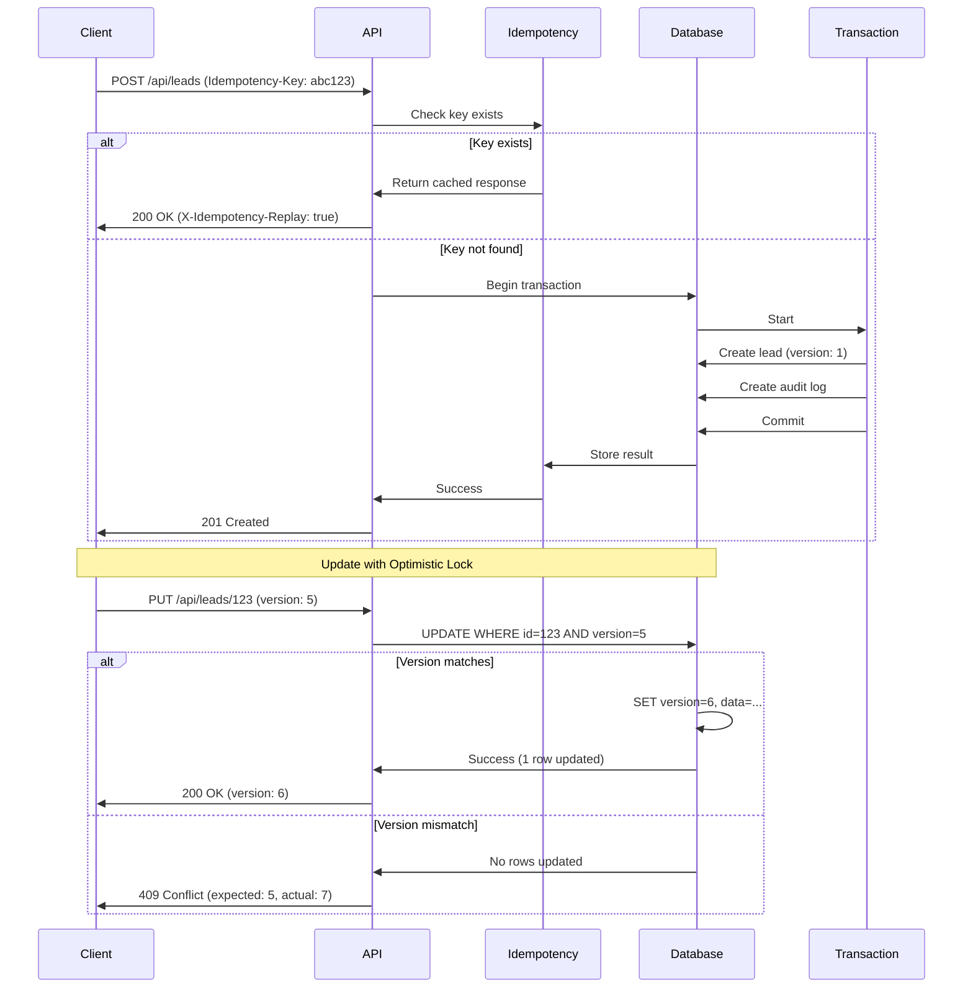

# Idempotency and Optimistic Locking Guide

## Idempotency Keys

All write operations (POST, PUT, DELETE) support idempotency keys to prevent duplicate operations.

### Usage

Include the `Idempotency-Key` header in your request:

```bash
curl -X POST https://api.example.com/api/leads \
  -H "Idempotency-Key: unique-key-12345" \
  -H "Content-Type: application/json" \
  -d '{"company": "Acme Corp", ...}'
```

### Key Requirements
- 16-128 alphanumeric characters (including `-` and `_`)
- Must be unique per operation
- Valid for 24 hours
- Reusing a key with different request body returns 422 error

### Response Headers
- `X-Idempotency-Replay: true` - Indicates cached response

## Optimistic Locking

All update operations require a `version` field to prevent concurrent modification conflicts.

### Workflow

1. **Fetch record with version:**
```json
GET /api/leads/123
{
  "id": "123",
  "company": "Acme",
  "version": 5
}
```

2. **Update with version:**
```json
PUT /api/leads/123
{
  "company": "Acme Corp",
  "version": 5
}
```

3. **Success response:**
```json
{
  "success": true,
  "data": {
    "id": "123",
    "company": "Acme Corp",
    "version": 6
  }
}
```

4. **Conflict response (409):**
```json
{
  "success": false,
  "error": "CONFLICT",
  "code": "OPTIMISTIC_LOCK_FAILED",
  "message": "The record was modified by another user",
  "details": {
    "expectedVersion": 5,
    "actualVersion": 7
  }
}
```

### Handling Conflicts

When receiving a 409 conflict:
1. Fetch the latest version of the record
2. Show user the differences
3. Allow user to resolve conflicts
4. Retry update with new version

## Transaction Guarantees

All multi-step operations are wrapped in database transactions:
- Lead → Case conversion
- Bulk case assignment
- Bulk document operations

If any step fails, all changes are rolled back automatically.

## Architecture Diagram



## API Endpoints with Idempotency Support

| Endpoint | Method | Idempotency | Optimistic Locking |
|----------|--------|-------------|-------------------|
| `/api/leads/[id]` | PUT | ✅ | ✅ |
| `/api/cases/[id]` | PUT | ✅ | ✅ |
| `/api/documents/[id]` | PATCH | ✅ | ✅ |
| `/api/cases/[id]/status` | PATCH | ✅ | ✅ |
| `/api/cases/[id]/assign` | POST | ✅ | ✅ |
| `/api/cases/bulk-assign` | POST | ✅ | N/A (Bulk) |
| `/api/documents/bulk` | POST | ✅ | N/A (Bulk) |
| `/api/leads/[id]/forward` | POST | ✅ | N/A (Create) |

## Error Codes

| Code | Status | Description |
|------|--------|-------------|
| `OPTIMISTIC_LOCK_FAILED` | 409 | Version mismatch during update |
| `IDEMPOTENCY_KEY_CONFLICT` | 409 | Key used by different tenant |
| `IDEMPOTENCY_KEY_REUSED` | 422 | Same key, different request body |
| `INVALID_IDEMPOTENCY_KEY` | 400 | Key format invalid |

## Cleanup

Expired idempotency logs are automatically cleaned up after 24 hours via the scheduled cleanup job.
